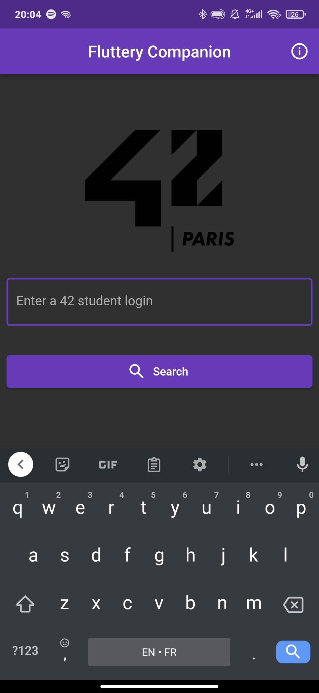
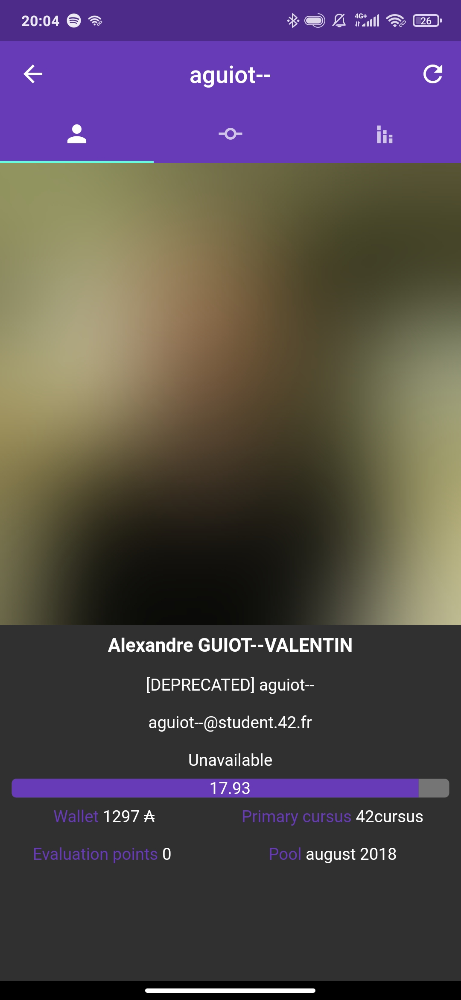
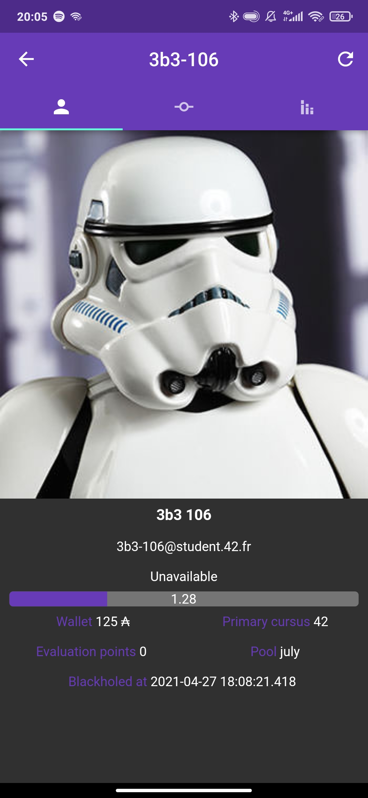
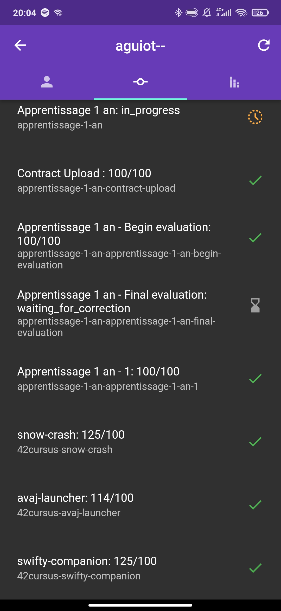
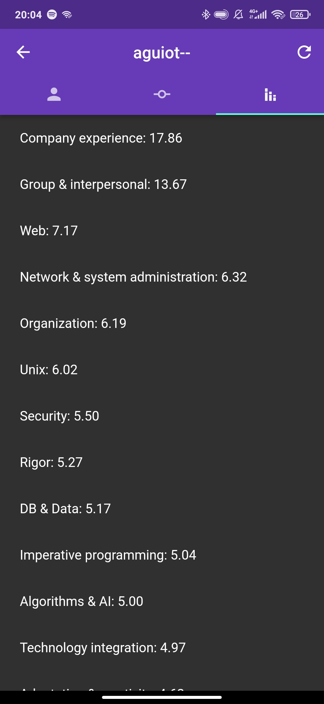
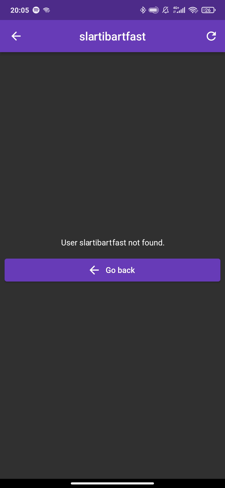
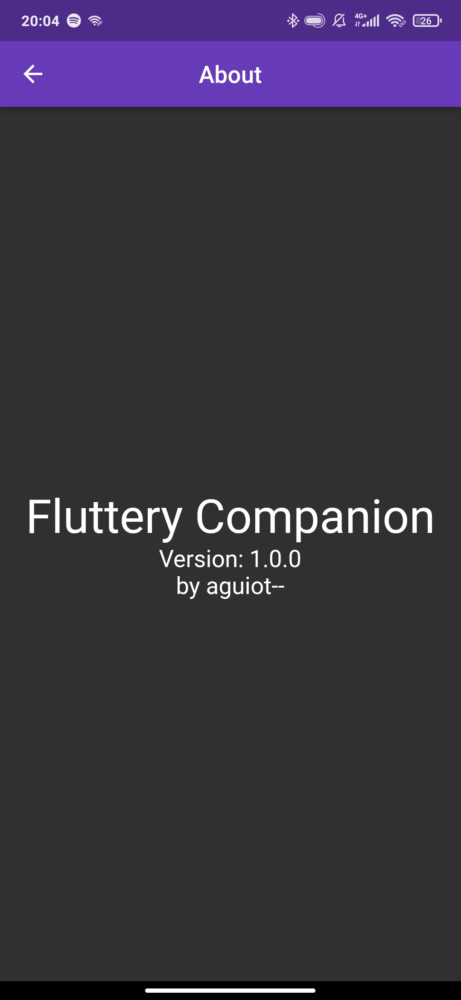
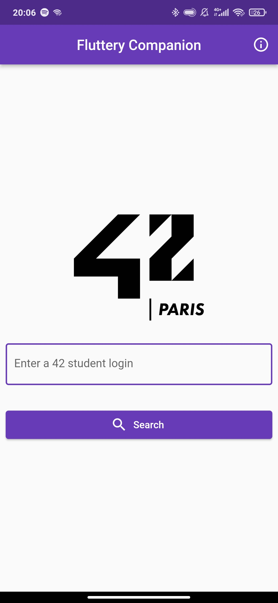
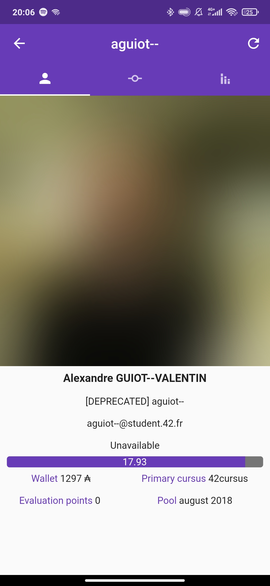

# swifty_companion

Mobile initiation at 42.  
The goal is to create a mobile app for the intra, allowing to search for a login, get its profile informations, projects, and skills/experiences.  
The user first has to login through OAuth2, with his own intra account.  
The app handles light and dark themes, and is responsive.  

### Screenshots

### Build and run

You will need the Android and Flutter SDKs, plus an API app of 42's intranet.  
Fill you app credentials in `lib/intra_http_service.dart`, and then build with `flutter build`.
